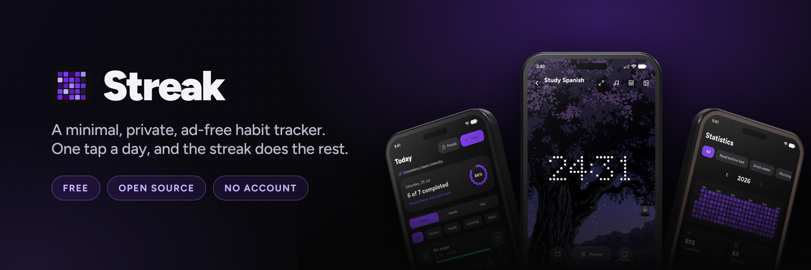
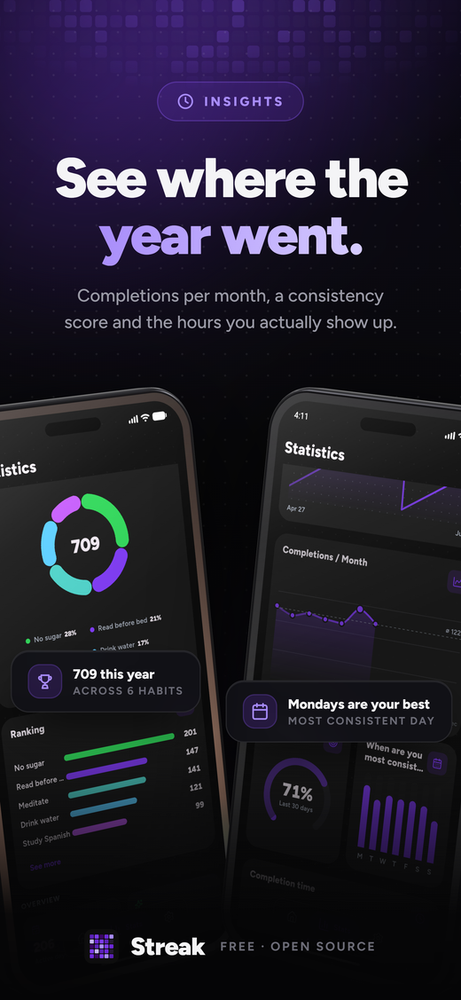
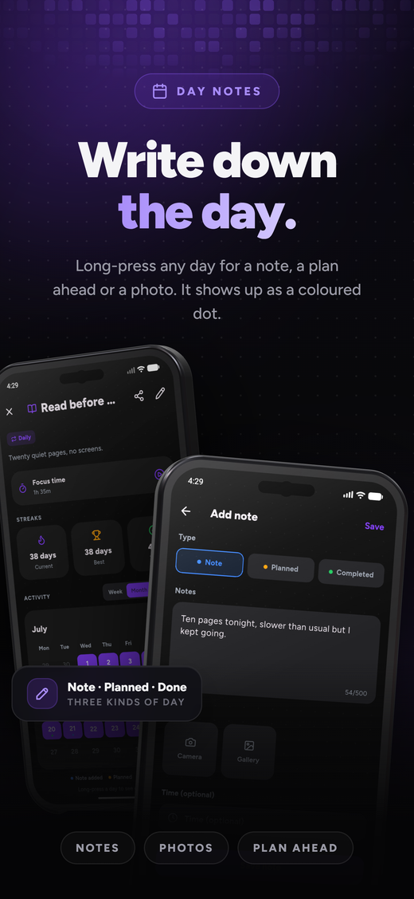
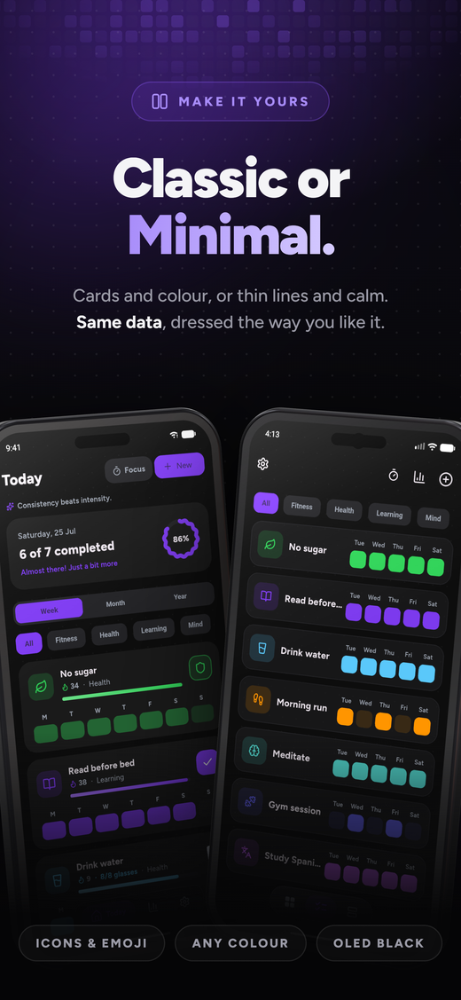

---

  <a href="README.md">English</a> · <b>Español</b> · <a href="README.zh-CN.md">中文</a> · <a href="README.ru.md">Русский</a>

### Streak

### Un rastreador de hábitos minimalista, privado y sin anuncios

Registra un hábito con un solo toque, mantén tu constancia y mira crecer tus rachas.

 

  
  
  
  
  

 

&nbsp;

&nbsp;

&nbsp;

 

  <a href="#-características">Características</a> ·
  <a href="#-vienes-de-otra-app">Importar</a> ·
  <a href="#-descarga">Descarga</a> ·
  <a href="#-privacidad">Privacidad</a> ·
  <a href="#-traducciones">Traducciones</a>

---

<b>Hoy</b> · <b>Concentración</b> · <b>Estadísticas</b> · <b>Análisis</b> · <b>Cantidades</b> · <b>Notas</b> · <b>Personaliza</b> · <b>Libre y privada</b>

---

## 👋 Resumen

Streak es un rastreador de hábitos de código abierto para Android que te respeta.
Crea todos los hábitos que quieras, regístralos con un toque y mira tu progreso
crecer en una cuadrícula de actividad al estilo de GitHub, contadores de racha y
un panel de estadísticas.

Es rápido, funciona sin conexión y está pensado para transmitir calma en lugar de
exigir.

> [!TIP]
> **Tuya, por completo.** Sin cuentas, sin suscripciones, sin anuncios, sin
> rastreo. Cada hábito y ajuste se queda en tu dispositivo, y todo el código es
> abierto.

---

## ✨ Características

<table>
<tr>
<td width="50%" valign="top">

### ✅ Seguimiento

- Registro con un toque desde la pantalla de inicio, un widget o la
  notificación
- Tres tipos de hábito: **normal**, **evitar** (con recaídas) y **cantidad**,
  con tu unidad y tu meta diaria
- Las **listas de pasos** dividen un hábito en partes, hecho al marcarlas todas
- **Horarios flexibles**: diario, X veces por semana o mes, días concretos o
  cada N días
- **Rellena el pasado**: toca cualquier día para añadirlo o quitarlo
- **Notas del día**: mantén pulsado un día para contar qué pasó o añadir una
  foto
- El **modo vacaciones** pausa un hábito sin romper nada

</td>
<td width="50%" valign="top">

### 📊 Ver tu progreso

- **Cuadrícula de actividad** al estilo de GitHub, por semana, mes o año entero
- **Calendario mensual**, con la semana empezando en lunes, sábado o domingo
- **Completados por mes**, para ver la forma de un año entero
- **Evolución de la racha** en una gráfica, para verla subir
- **"¿Cuándo eres más constante?"** encuentra las horas a las que de verdad
  cumples
- Totales, mejor racha, racha actual, cumplimiento y una puntuación de
  **fuerza** por hábito
- Una **tarjeta de progreso** para compartir, en varios tamaños y exportada
  como imagen cuidada

</td>
</tr>
<tr>
<td width="50%" valign="top">

### 🧘 Sesiones de concentración

- Un temporizador para los hábitos que lo piden, libre o atado a un hábito y
  su meta
- **Rondas pomodoro** con descansos cortos, o una sola sesión larga
- Tres estilos de reloj: **Círculo**, **Flip** y **Puntos**
- Sonidos incluidos (lluvia, ruido marrón, pad cálido) o tus propias pistas,
  en orden o aleatorias
- Escenas tranquilas de fondo, o una foto tuya
- Marca subtareas sin salir del temporizador, y deja la pantalla encendida
- Una **meta diaria de concentración**, más el historial de cada sesión

</td>
<td width="50%" valign="top">

### 🎨 Hacerla tuya

- **Clásico o Minimal**: la lista de hábitos con barra inferior, o una
  cuadrícula con todo agrupado en cuatro secciones
- Pack de iconos minimalista, o cualquier emoji que quieras
- Color de acento personalizado con selector completo
- Temas claro y oscuro, más cinco fondos: sólido, degradado, puntos, negro
  puro OLED o una foto tuya
- Portadas, categorías, reordenar arrastrando, nombre y foto de perfil
- Tres iconos de aplicación, para que Streak pegue con tu pantalla de inicio
- Una lluvia de confeti el día que lo completas todo

</td>
</tr>
<tr>
<td width="50%" valign="top">

### 🔔 Recordatorios y widgets

- Recordatorios por hábito, los días que elijas o cada N días, cada uno con
  una frase de ánimo
- Botones de **Hecho**, **Posponer** y **Añadir cantidad** en la propia
  notificación
- **Cuatro widgets de inicio**: hábito, hoy, estadísticas y cuadrícula de
  actividad
- Cada widget con su estilo propio: color o foto, opacidad y borde
- Elige qué datos muestra el **widget de estadísticas** y cómo se colocan
- Marca un día desde el widget, se guarda sin abrir la app
- Toca la cuadrícula de actividad para entrar directo en ese hábito

</td>
<td width="50%" valign="top">

### 💾 Tus datos

- **Importa** desde Loop Habit Tracker, HabitKit, Habitica y HabitBull, con
  historial y rachas, o desde cualquier CSV con un hábito y una fecha
- Copia de seguridad y restauración en un solo archivo que guardas tú
- **Copias automáticas**, diarias o semanales, en la carpeta que elijas
- **Bloqueo de la app** con PIN o huella, para móviles que no lo traen
- **Archiva** hábitos sin perder un solo día de su historial
- Todo sin conexión: sin cuenta, sin servidor, nada que sincronizar
- Diez idiomas, con más abiertos en Weblate

</td>
</tr>
</table>

---

## 📦 ¿Vienes de otra app?

Tráete tu historial. Streak lee exportaciones de **Loop Habit Tracker**,
**HabitKit**, **Habitica** y **HabitBull**, así que tus días pasados y tus
rachas sobreviven a la mudanza. Cualquier otro CSV vale también, mientras tenga
un hábito y una fecha.

<b>Ajustes → Datos → Importar de otra app</b>

---

## ⬇️ Descarga

[**F-Droid**](https://f-droid.org/packages/com.streak.app/) es lo más cómodo:
instala Streak y lo mantiene actualizado por ti. También está en
[**IzzyOnDroid**](https://apt.izzysoft.de/fdroid/index/apk/com.streak.app?repo=main)
y [**OpenAPK**](https://www.openapk.net/streak/com.streak.app/).

¿Prefieres el APK directo? Está en la página de
[**Releases**](https://github.com/InlitX/streak/releases), un archivo por tipo de
teléfono para que cada descarga sea pequeña:

| APK | Para |
|-----|------|
| `Streak-arm64-v8a.apk` | Teléfonos modernos de 64 bits, **elige este** |
| `Streak-armeabi-v7a.apk` | Dispositivos antiguos de 32 bits |
| `Streak-x86_64.apk` | Emuladores y tablets x86 |

Funciona en **Android 9 (Pie) o superior**.

> [!NOTE]
> Streak no está en la Play Store. Como el APK no viene de una tienda, puede que
> Android te pida permitir instalaciones desde tu navegador o gestor de archivos
> la primera vez.

---

## 🔒 Privacidad

> [!IMPORTANT]
> Streak **no tiene analíticas, ni SDK de publicidad, ni backend de red**. La app
> nunca envía tus datos a ningún sitio: se quedan en tu dispositivo. Las únicas
> acciones salientes son los enlaces que tú decides abrir.

---

## 🌍 Traducciones

Streak habla **inglés, español, ruso y chino** por completo, y **alemán,
portugués, ucraniano, polaco, francés e indonesio** están en camino; cualquier
idioma nuevo es bienvenido. Las
traducciones se gestionan en [**Weblate**](https://hosted.weblate.org/engage/streak/):
no hace falta programar, solo son frases cortas que traduces en el navegador.

&nbsp;&nbsp;&nbsp;&nbsp;&nbsp;&nbsp;&nbsp;&nbsp;&nbsp;&nbsp;&nbsp;&nbsp;&nbsp;&nbsp;&nbsp;&nbsp;&nbsp;&nbsp;&nbsp;&nbsp;&nbsp;&nbsp;&nbsp;&nbsp;&nbsp;&nbsp;&nbsp;&nbsp;&nbsp;&nbsp;&nbsp;&nbsp;

Cómo funciona → [**TRANSLATING.md**](TRANSLATING.md)

---

## 🛠️ Contribuir

Los informes de fallos, las ideas y los pull requests son bienvenidos, mira
[**CONTRIBUTING.md**](CONTRIBUTING.md). Para algo más grande que un arreglo, abre
antes una incidencia y acordamos la dirección.

---

## ❤️ Apoyo

Si Streak te ayuda a mantener la constancia, una estrella o un café significan mucho.

&nbsp;&nbsp;

 
 

<a href="https://www.star-history.com/?repos=InlitX%2Fstreak&type=date&legend=top-left">
 <picture>
   <source media="(prefers-color-scheme: dark)" srcset="https://api.star-history.com/chart?repos=InlitX/streak&type=date&theme=dark&legend=top-left&sealed_token=aNqDTOocHK1NkSrMsZrD1iFDpo1AtZvvUo3ZqETCzSujh-eSh0ekwpay4FpVGocizt1wmR5QWrkuMUAl2r9yllwF4v9e3tnsI6c1lv0upumuFVgsXGvAwA" />
   <source media="(prefers-color-scheme: light)" srcset="https://api.star-history.com/chart?repos=InlitX/streak&type=date&legend=top-left&sealed_token=aNqDTOocHK1NkSrMsZrD1iFDpo1AtZvvUo3ZqETCzSujh-eSh0ekwpay4FpVGocizt1wmR5QWrkuMUAl2r9yllwF4v9e3tnsI6c1lv0upumuFVgsXGvAwA" />
   
 </picture>
</a>

 
 

Publicado bajo la <a href="LICENSE"><b>Licencia GNU GPLv3</b></a>.

