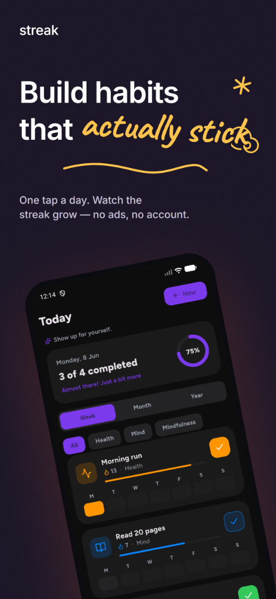
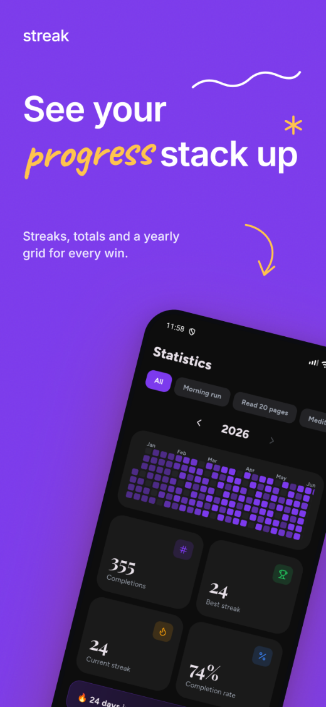

<div align="center">


# Streak

### A minimal, private, ad-free habit tracker built with Flutter

Log a habit in a single tap, keep your momentum, and watch your streaks grow.

<br/>

<p>
  
  
  
  
  
</p>

<br/>

<a href="https://f-droid.org/packages/com.streak.app/"></a>
&nbsp;
<a href="https://github.com/InlitX/streak/releases"></a>

<br/>
<br/>

**English** · [Español](README.es.md) · [中文](README.zh-CN.md)

</div>

---

> [!TIP]
> **Yours, completely.** No accounts, no subscriptions, no ads, no tracking.
> Every habit and setting stays on your device — and the full source is open.

## Overview

Streak is a habit tracker that respects you. Create as many habits as you like,
log them with one tap, and follow your progress through a GitHub-style activity
grid, streak counters and a statistics dashboard. It is fast, offline, and built
to feel calm rather than demanding.

---

## Screenshots

<p align="center">
  
  
  
  
  
</p>

<div align="center"><sub><b>Today</b> · <b>Statistics</b> · <b>Insights</b> · <b>Personalize</b> · <b>Free &amp; private</b></sub></div>

---

## Download

The easiest way is [**F-Droid**](https://f-droid.org/packages/com.streak.app/), which
installs Streak and keeps it up to date automatically.

Prefer the raw APK? Grab it from the [**Releases**](https://github.com/InlitX/streak/releases)
page. Builds are split per CPU architecture to keep each download small — pick the one
that matches your phone (most modern devices are **arm64-v8a**):

| APK | For |
|-----|-----|
| `Streak-arm64-v8a.apk` | Modern 64-bit phones (recommended) |
| `Streak-armeabi-v7a.apk` | Older 32-bit devices |
| `Streak-x86_64.apk` | Emulators / x86 tablets |

> [!NOTE]
> Streak isn't on the Play Store. Since the APK isn't from a store, Android may
> ask you to allow installs from your browser/file manager the first time.

---

## Features

<table>
<tr>
<td width="50%" valign="top">

**Tracking**
- One-tap logging from the home screen
- Daily, weekly and monthly goals
- Current and best streak counters
- Habit "strength" based on recent consistency

</td>
<td width="50%" valign="top">

**Visualization**
- GitHub-style activity grid (week / month / year)
- Statistics dashboard with trends and totals
- Shareable progress card as a polished image

</td>
</tr>
<tr>
<td width="50%" valign="top">

**Personalization**
- Minimalist icon pack and emoji support
- Custom accent color with a full color picker
- Light / dark themes and selectable backgrounds
- Categories, reordering, profile name and photo

</td>
<td width="50%" valign="top">

**Data & platform**
- Per-habit reminders on the days you choose
- Backup and restore as a portable JSON file
- Three home-screen widgets
- English and Spanish, fully offline

</td>
</tr>
</table>

---

## Tech stack

| Area | Choice |
|------|--------|
| Framework | Flutter (Dart) |
| State management | provider |
| Local storage | hive_ce |
| Charts | fl_chart |
| Notifications | flutter_local_notifications + timezone |
| Home widgets | home_widget + Jetpack Glance (Kotlin) |
| Icons | Lucide |

---

## Project structure

<details open>
<summary><b>Directory layout</b></summary>

```
lib/
├── main.dart                 App entry point and home-widget callback
├── app/                      App shell, navigation host and theming
│   └── theme/                Palette, design tokens, light/dark themes
├── core/                     Cross-cutting building blocks
│   ├── database/             Local persistence (Hive)
│   ├── extensions/           Date helpers
│   ├── i18n/                 Localized strings
│   ├── icons/                Icon and emoji catalogs
│   ├── routing/              Navigation and page transitions
│   ├── utils/                Snackbars and helpers
│   └── widgets/              Shared UI primitives
├── features/                 Feature-first modules
│   ├── habits/               data · state · pages · widgets
│   ├── statistics/           Statistics dashboard
│   ├── settings/             Preferences and About
│   └── onboarding/           First-run experience
└── services/                 Notifications, home widgets, backup

android/                      Android host project and home-widget layouts
assets/                       App icon and bundled images
fonts/                        Figtree and Playfair Display
docs/screenshots/             Marketing screenshots used in this README
tool/                         Icon-generation scripts (dev only)
```

</details>

---

## Getting started

### Prerequisites

- Flutter SDK (stable channel)
- Android Studio or the Android SDK, with a device or emulator

### Run

```bash
git clone https://github.com/InlitX/streak.git
cd streak
flutter pub get
flutter run
```

### Build release APKs

```bash
# one APK per architecture (arm64-v8a, armeabi-v7a, x86_64)
flutter build apk --release --split-per-abi
```

Pushing a `v*` tag runs the GitHub Actions workflow, which builds these split
APKs plus a source archive and attaches them to a new GitHub Release.

> [!TIP]
> To sign a release build, create `android/key.properties` with your keystore
> details. That file and any keystore are intentionally git-ignored; without
> them, release builds fall back to the debug signing key.

---

## Architecture notes

- **Feature-first layout.** Each feature owns its data models, state
  controllers, pages and widgets, keeping boundaries clear.
- **Single source of truth.** Habits, categories and settings are persisted in
  Hive and exposed through `ChangeNotifier` controllers.
- **Resilient storage.** Corrupt or schema-mismatched records are skipped
  instead of crashing startup, and non-critical startup work (notifications,
  widgets) is isolated so it can never block the app from launching.
- **Consistent navigation.** Every push flows through a single navigator with
  opaque page transitions, so screens never bleed through during animations.

---

## Privacy

> [!IMPORTANT]
> Streak has **no analytics, no advertising SDK and no network backend**.
> The app never sends your data anywhere — it stays on your device. The only
> outbound actions are links you choose to open yourself.

---

## Support

<div align="center">

If Streak helps you show up more often, a star or a coffee goes a long way:

<a href="https://github.com/InlitX/streak"></a>
&nbsp;&nbsp;
<a href="https://ko-fi.com/inlitx"></a>

</div>

---

## Contributing

Issues and pull requests are welcome. For larger changes, please open an issue
first to discuss the direction.

---

## License

Released under the [MIT License](LICENSE).
