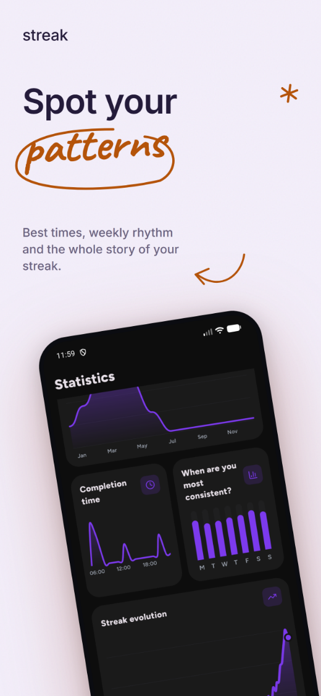
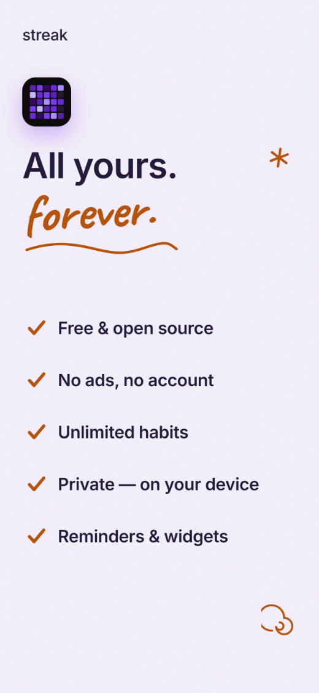

  <a href="README.md">English</a> · <a href="README.es.md">Español</a> · <b>中文</b>

 

# Streak

### 极简、私密、无广告的习惯追踪应用

一键记录习惯，保持势头，看着你的连续记录不断增长。

 

  
  
  
  
  

 

&nbsp;

&nbsp;

 

  <a href="#功能">功能</a> ·
  <a href="#从其他应用迁移">导入</a> ·
  <a href="#下载">下载</a> ·
  <a href="#隐私">隐私</a> ·
  <a href="#翻译">翻译</a>

---

<b>今天</b> · <b>统计</b> · <b>洞察</b> · <b>个性化</b> · <b>免费且私密</b>

---

## 概览

Streak 是一款尊重你的开源 Android 习惯追踪应用。你可以创建任意多个习惯，一键记录，
并通过类似 GitHub 的活动网格、连续记录计数器和统计面板来跟踪进度。

它快速、可离线使用，力求让人感到平静，而非催促。

> [!TIP]
> **完全属于你。** 无需账号、无订阅、无广告、无追踪。
> 每个习惯和设置都保存在你的设备上，而且全部源代码开放。

---

## 功能

<table>
<tr>
<td width="50%" valign="top">

### ✅ 追踪

- 在主屏幕或小组件上一键记录
- 三种习惯类型 —— **普通**、**戒除**（可记录复发）和
  **数量**（喝水、阅读，或你自己的单位与每日目标）
- **清单**把一个习惯拆成若干步骤，全部勾选才算完成
- **灵活的周期** —— 每天、每周或每月若干次、指定星期几，或每 N 天
- **补记过去** —— 点按任意一天即可补上或取消，连续记录随之更新
- 当前连续记录与最佳连续记录计数器
- **假期模式**可暂停习惯而不中断任何记录
- 已完成的习惯自动沉到底部，剩下的一目了然

</td>
<td width="50%" valign="top">

### 📊 查看进度

- 类似 GitHub 的**活动网格** —— 周、月或年
- **月历**，一周可从周一、周六或周日开始
- **每月完成次数**，一眼看清整年的走势
- **连续记录演变**曲线，看着它一路上扬
- **“你在什么时候最坚持？”** 找出你真正会去做的时段
- 总计、最佳连续记录、当前连续记录和完成率，一行呈现
- 每个习惯的**强度**评分，近期表现权重更高
- 可分享的**进度卡片**，导出为精美图片

</td>
</tr>
<tr>
<td width="50%" valign="top">

### 🎨 个性化

- 极简图标包，或任意表情符号
- 自定义强调色，配有完整取色器
- 浅色与深色主题，外加五种背景 —— 纯色、渐变、圆点、
  纯黑 OLED，或你自己的照片
- 封面图、分类、拖动排序、个人资料名称和头像
- 三种启动器图标，让 Streak 融入你的主屏幕
- 全部完成的那天会有一阵彩纸雨

</td>
<td width="50%" valign="top">

### 🔔 提醒、小组件与备份

- 按习惯设置提醒，可选具体星期几或每 N 天，每条都带一句鼓励语，
  而不是干巴巴的通知
- **四个主屏幕小组件** —— 习惯、今天、统计和活动网格 ——
  每个都可单独设置颜色或照片、透明度和边框
- 直接在小组件上勾选某一天，无需打开应用即可保存
- 备份与恢复只用一个由你自己保管的文件
- 支持英语和西班牙语，完全离线

</td>
</tr>
</table>

---

## 从其他应用迁移

把你的历史一起带过来。Streak 可以读取 **Loop Habit Tracker** 和 **HabitKit**
的导出文件，让你过去的记录和连续记录都不丢失。更多应用的支持正在开发中。

<b>设置 → 数据 → 从其他应用导入</b>

---

## 下载

最简单的方式是 [**F-Droid**](https://f-droid.org/packages/com.streak.app/)，
它会安装 Streak 并自动保持更新。

想直接下载 APK？前往 [**Releases**](https://github.com/InlitX/streak/releases)
页面，每种手机类型对应一个文件，以保持下载包小巧：

| APK | 适用于 |
|-----|--------|
| `Streak-arm64-v8a.apk` | 现代 64 位手机 —— **选它** |
| `Streak-armeabi-v7a.apk` | 较旧的 32 位设备 |
| `Streak-x86_64.apk` | 模拟器和 x86 平板 |

需要 **Android 9（Pie）及以上**。

> [!NOTE]
> Streak 未上架 Play 商店。由于该 APK 不是来自应用商店，Android 在首次安装时
> 可能会要求你允许从浏览器或文件管理器安装。

---

## 隐私

> [!IMPORTANT]
> Streak **没有分析统计、没有广告 SDK、没有网络后端**。应用绝不会把你的数据
> 发送到任何地方，它们只留在你的设备上。唯一的对外动作是你自己选择打开的链接。

---

## 翻译

Streak 目前支持英语和西班牙语，非常欢迎更多语言。翻译工作在
[**Weblate**](https://hosted.weblate.org/engage/streak/) 上进行：无需编程，
只是一些在浏览器里就能翻译的短句。

&nbsp;&nbsp;&nbsp;&nbsp;&nbsp;&nbsp;&nbsp;&nbsp;&nbsp;&nbsp;&nbsp;&nbsp;&nbsp;&nbsp;&nbsp;&nbsp;&nbsp;&nbsp;&nbsp;&nbsp;&nbsp;&nbsp;&nbsp;&nbsp;&nbsp;&nbsp;&nbsp;&nbsp;&nbsp;&nbsp;&nbsp;&nbsp;

了解详情 → [**TRANSLATING.md**](TRANSLATING.md)

---

## 参与贡献

欢迎问题反馈、想法和 pull request —— 请看
[**CONTRIBUTING.md**](CONTRIBUTING.md)。如果不只是小修小补，请先开一个 issue，
我们先就方向达成一致。

---

## 支持

如果 Streak 帮你更常坚持下来，一颗星或一杯咖啡都意义重大。

&nbsp;&nbsp;

 
 

<a href="https://www.star-history.com/?repos=InlitX%2Fstreak&type=date&legend=top-left">
 <picture>
   <source media="(prefers-color-scheme: dark)" srcset="https://api.star-history.com/chart?repos=InlitX/streak&type=date&theme=dark&legend=top-left&sealed_token=aNqDTOocHK1NkSrMsZrD1iFDpo1AtZvvUo3ZqETCzSujh-eSh0ekwpay4FpVGocizt1wmR5QWrkuMUAl2r9yllwF4v9e3tnsI6c1lv0upumuFVgsXGvAwA" />
   <source media="(prefers-color-scheme: light)" srcset="https://api.star-history.com/chart?repos=InlitX/streak&type=date&legend=top-left&sealed_token=aNqDTOocHK1NkSrMsZrD1iFDpo1AtZvvUo3ZqETCzSujh-eSh0ekwpay4FpVGocizt1wmR5QWrkuMUAl2r9yllwF4v9e3tnsI6c1lv0upumuFVgsXGvAwA" />
   
 </picture>
</a>

 
 

基于 <a href="LICENSE"><b>MIT 许可证</b></a> 发布。

